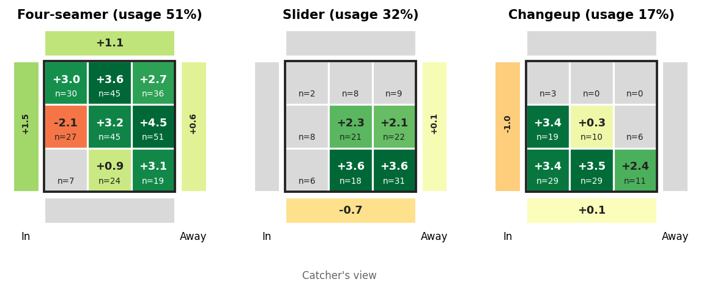
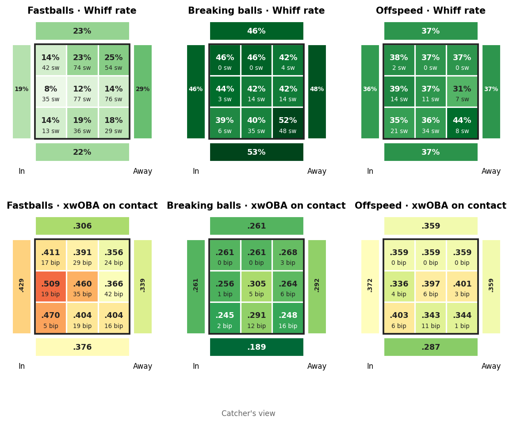
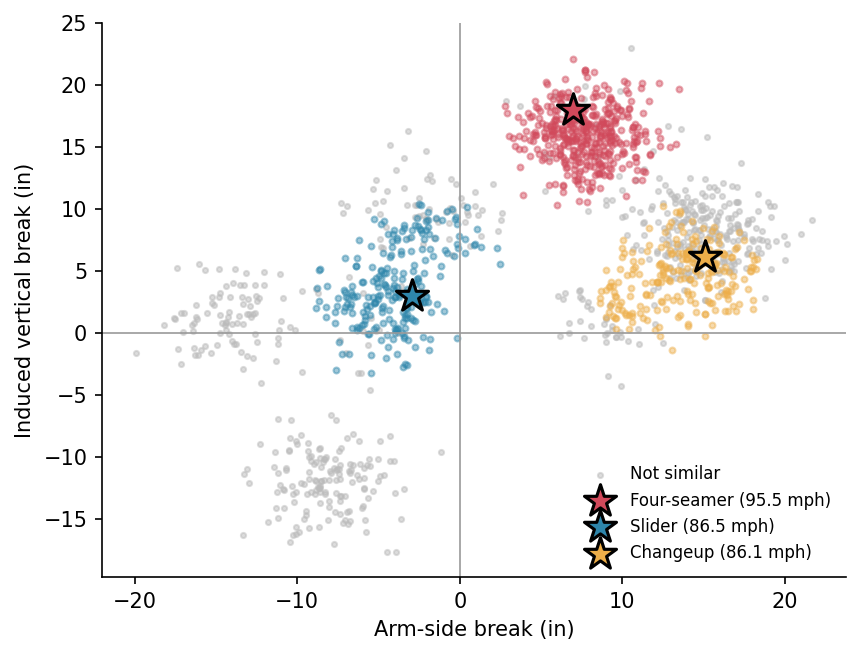

# pitchplan

**How should we pitch to this hitter?** `pitchplan` turns Statcast pitch-level data into a one-page, coach-ready game plan for a specific pitcher vs. a specific hitter, in English or Spanish.

It goes beyond describing the hitter ("he struggles with sliders") and makes a matchup-specific recommendation: which of *our pitcher's* pitches to throw, where, and in which counts, based on how the hitter has done against pitches that **move like ours**.



## Sample output

The report leads with a short plan a pitcher and catcher can absorb in two minutes (from the included demo data):

> 1. Ambushes early: swings at 48% of first pitches (league ~30%). No get-me-over strikes; start him with the four-seamer middle-away.
> 2. Put-away pitch with two strikes: the changeup down, middle. He misses on 38% of his swings at similar pitches there (26 swings).
> 3. Expands the zone: chases 33% of pitches outside it (league ~28%). When ahead, make him chase the four-seamer above the zone.
> 4. When behind: the four-seamer up, middle is the safest strike.
> 5. Avoid the four-seamer middle-in: .577 xwOBA on contact against similar pitches there (12 balls in play).

Below that: a plan-by-count table, the location grids above, the hitter's tendencies vs. league average, whiff and damage maps, and a note on sample sizes and method. Full example reports are in [`examples/`](examples/) (open the HTML files in a browser).

| Hitter by location | How pitches were matched |
|---|---|
|  |  |

## Quick start

```bash
pip install -r requirements.txt

# Runs on built-in synthetic data, no internet needed
python -m pitchplan --demo --backtest
python -m pitchplan --demo --lang es

# Real MLB data via pybaseball (names or MLBAM ids)
python -m pitchplan --hitter "Juan Soto" --pitcher "Kevin Gausman" \
    --start 2025-03-27 --end 2025-09-28 --backtest

# Your own CSVs exported from Baseball Savant search
python -m pitchplan --hitter "Opposing Hitter" --hitter-csv hitter.csv \
    --pitcher "Our Pitcher" --pitcher-csv pitcher.csv
```

Each run writes a self-contained HTML report and a CSV of every scored option to `output/`.

## How it works

**1. Summarize the pitcher's arsenal.** Average velocity, arm-side break, and induced vertical break for each pitch he throws at least 3% of the time.

**2. Match by pitch shape, not pitch name.** Every pitch the hitter has seen is compared to each arsenal pitch using scaled distance on velocity and movement. Pitches close enough count as "similar"; the rest are ignored for pitch-specific estimates. A "slider" from one pitcher can play like a cutter from another, so names alone are misleading. By default only pitches from same-handed pitchers are used, since a lefty's slider attacks a hitter from the opposite direction.

**3. Estimate run value everywhere, carefully.** For every pitch × location × count state, the tool estimates run value (Statcast `delta_run_exp`, from the batter's side) using hierarchical shrinkage: a thin cell is pulled toward a broader estimate, which is pulled toward a broader one still.

```
hitter overall → pitch group → group × location → similar pitch × location → × count
```

This is the key design choice. Minor league and early-season samples are small, and 12 pitches in one spot can make a hitter look elite or helpless by chance. Shrinkage means a recommendation needs real evidence behind it. Sample sizes are shown next to every number so a coach knows when to trust it.

**4. Blend hitter and pitcher.** Each option's score combines the hitter's results vs. similar pitches (60%) with the pitcher's own results with that pitch in that spot (40%). Options where the pitcher rarely throws that pitch (<3% of the time) are excluded, since a plan he can't execute isn't a plan.

**5. Add baseball logic.** When the pitcher is behind in the count, only pitches in the zone are recommended. Each count shows a varied set of options rather than the same pitch three times.

**6. Write it in plain language.** Rankings are turned into short sentences using templates, with tendencies like first-pitch aggression and chase rate compared to league average. A `--lang es` flag produces the full report in Spanish.

## Does it work? (backtesting)

`--backtest` builds the plan using the first half of the hitter's games, then checks the second half: did pitches similar to our arsenal that *followed the plan* produce better results than those that didn't? It reports the difference in runs per 100 pitches with a bootstrap 95% interval. On the demo data the plan saves about 3 runs per 100 pitches, but the interval is wide and crosses zero, which is the honest result for one hitter's half season. Results on real players will vary, and a single hitter's sample is often too small for a clear verdict.

## Project structure

```
pitchplan/
  config.py     all tunable constants (shrinkage strength, weights, thresholds)
  data.py       loading (pybaseball / CSV) and feature engineering
  profile.py    hitter tendencies and location grids
  matchup.py    arsenal, shape matching, hierarchical run values, ranking
  report.py     plain-language plan + HTML report
  plots.py      figures
  i18n.py       English / Spanish text
  evaluate.py   backtest
  synthetic.py  demo data with built-in hitter tendencies
tests/          pytest suite (pytest -q)
```

The demo hitter was built with known tendencies (he punishes fastballs middle-in, chases elevated fastballs, and misses breaking balls down and away). The test suite checks that the plan rediscovers the middle-in weakness, which is a useful sanity check for the whole pipeline.

## Limitations and next steps

- **Sequencing isn't modeled.** A changeup plays differently after three fastballs. Adding the previous pitch as a feature is the natural next step.
- **Recency.** All games are weighted equally; hitters adjust during a season, so time-decay weighting would help.
- **League baselines are approximate constants** used only for context in the text. Pulling real league-wide data would sharpen the comparisons.
- **Trackman support.** Affiliates work with Trackman CSVs; a column-mapping layer (`RelSpeed`, `InducedVertBreak`, `HorzBreak`, `PlateLocSide`, `PlateLocHeight`, etc.) would let the same engine run on that data.
- **Run values** come from Statcast when available and are otherwise approximated from count changes and outcomes using rough linear weights.
